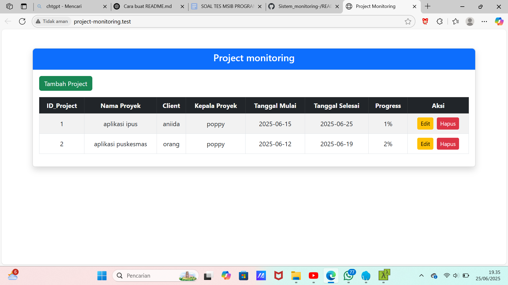
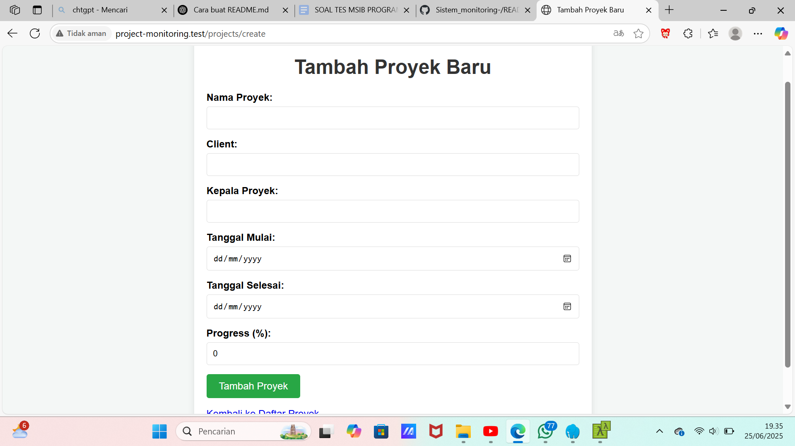
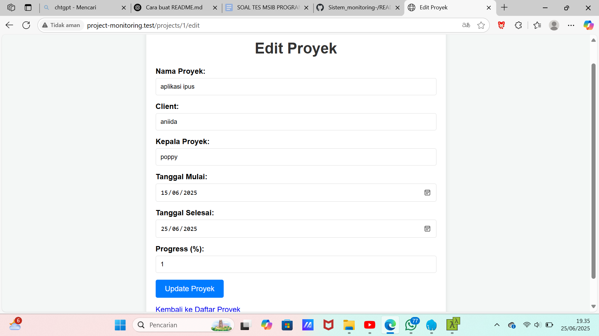

# 🗂 Sistem Informasi Project Monitoring Sederhana

Aplikasi Laravel sederhana untuk mengelola dan memantau data proyek, seperti:
- Nama proyek
- Project leader
- Tanggal mulai dan akhir
- Nama klien
- Progress proyek
- Upload foto proyek

---

## 👩‍💻 Dibuat Oleh
**Poppy**  
D3 Teknik Informatika  
Politeknik Hasnur  

---

## 📌 Fitur Aplikasi
✅ CRUD data proyek  
✅ Upload foto proyek  
✅ Tampilan tabel monitoring  
✅ Desain bersih dengan Tailwind CSS  
🚫 Tidak menggunakan login (sesuai ketentuan)

---

## 🛠 Teknologi
- Laravel 10
- MySQL
- Tailwind CSS
- Laravel File Storage

---

## 📸 Screenshot Tampilan

> Pastikan kamu sudah upload gambar ke folder `screenshots/`

### 📋 Daftar Project


### ➕ Tambah Project


### ✏️ Edit Project


---

## 🚀 Cara Menjalankan Project
```bash
git clone https://github.com/Poppy-poppy/Sistem_monitoring-.git
cd project-monitoring
composer install
cp .env.example .env
php artisan key:generate
php artisan migrate
php artisan serve
